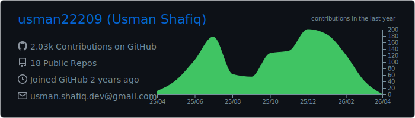
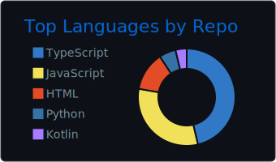
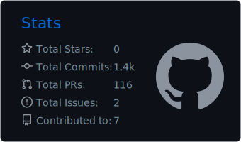
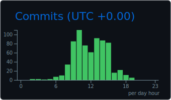

<div align="center">

# 👋 Hi, I'm Usman Shafiq

### Full-Stack Developer | React & React Native Specialist | AI & Automation Enthusiast

[](https://git.io/typing-svg)


</div>

---

## 🚀 About Me

```typescript
const usman = {
    location: "Pakistan 🇵🇰",
    role: "Full-Stack Developer",
    expertise: ["React", "React Native", "Next.js", "TypeScript"],
    backend: ["Node.js", "NestJS"],
    specialization: ["AI Integration", "n8n Workflow Automation"],
    passion: "Building intelligent, automated, and scalable solutions",
    currentlyLearning: "Advanced AI/ML Integration & System Design"
};
```

### What I Do:
- 💼 **Full-Stack Development** - Building production-ready applications with modern tech stacks
- 🤖 **AI Integration** - Implementing AI-powered features using Claude, GPT, and other LLMs
- 🔄 **Workflow Automation** - Creating intelligent automation workflows with **n8n** to streamline business processes
- 📱 **Mobile Apps** - Developing cross-platform mobile experiences with React Native
- 🎯 **Clean Code Advocate** - Writing maintainable, scalable, and performant code
- 🌱 **Continuous Learner** - Always exploring new technologies and best practices

---

## 🛠️ Tech Stack

<div align="center">

### Frontend


### Backend


### AI & Automation


### Database & Tools


</div>

---

## 📊 GitHub Stats

<div align="center">



</div>

<div align="center">




</div>

<div align="center">




</div>

---

## 🔥 Contribution Streak

<div align="center">

[](https://git.io/streak-stats)

</div>

---

## 🐍 My Contribution Graph (Real-time)

<div align="center">

> This snake animation represents my actual GitHub contributions over the past year!

<picture>
  <source media="(prefers-color-scheme: dark)" srcset="./dist/github-snake-dark.svg">
  <source media="(prefers-color-scheme: light)" srcset="./dist/github-snake.svg">
  
</picture>

</div>

---

## 📈 Activity Graph

<div align="center">

[](https://github.com/ashutosh00710/github-readme-activity-graph)

</div>

---

## 💼 What I Specialize In

<div align="center">

| 🎨 Frontend Development | 📱 Mobile Development | ⚙️ Backend Development |
|:---:|:---:|:---:|
| Building responsive, modern UIs | Cross-platform mobile apps | RESTful APIs & Microservices |
| React, Next.js expertise | React Native development | Node.js & NestJS |
| Performance optimization | Native integrations | Database design |

| 🤖 AI Integration | 🔄 Workflow Automation | 🏗️ Architecture |
|:---:|:---:|:---:|
| LLM API integration | n8n workflow design | Clean architecture patterns |
| AI-powered features | Process automation | Scalable system design |
| Prompt engineering | Custom integrations | Performance optimization |

</div>

---

## 🎯 Current Focus

<table align="center">
  <tr>
    <td align="center" width="200">
      
      <br><strong>React Ecosystem</strong>
    </td>
    <td align="center" width="200">
      
      <br><strong>TypeScript</strong>
    </td>
    <td align="center" width="200">
      
      <br><strong>AI APIs</strong>
    </td>
    <td align="center" width="200">
      
      <br><strong>DevOps</strong>
    </td>
  </tr>
</table>

---

## 🔧 Workflow Automation Projects

I build custom **n8n workflows** that automate complex business processes:
- 📧 Email automation & notifications
- 🔗 API integrations & data synchronization
- 📊 Automated reporting & data processing
- 🤖 AI-powered chatbots & assistants
- 🔄 Multi-platform content distribution

---

## 📫 Let's Connect

<div align="center">

[](mailto:usman.shafiq.dev@gmail.com)
[](https://www.linkedin.com/in/usman22209)
[](https://github.com/usman22209)

</div>

---


<div align="center">


**⭐ From [Usman22209](https://github.com/usman22209) | Let's build something amazing together! 🚀**

</div>
